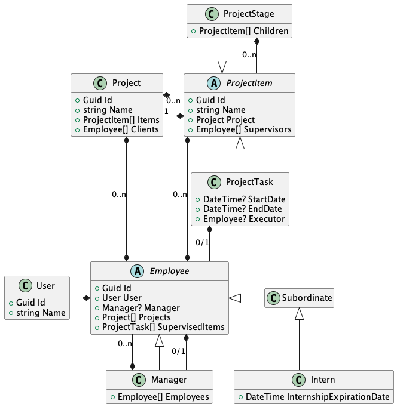

# Model

Для демонстрации используется данная модель.\
Модель относительно не сложная, она позволяет продемонстрировать разнообразие отношений между типами:

| Вид отношения | Участвующие типы               | Описание                                                        |
|---------------|--------------------------------|-----------------------------------------------------------------|
| one-to-one    | `Employee *- User`             | Простое отношение один к одному                                 |
| one-to-one    | `ProjectTask *-- Employee`     | Отношение один к одному, присутствующее только на дочернем типе |
| one-to-many   | `Project *-- ProjectItem`      | Простое отношение один ко многим                                |
| one-to-many   | `Manager *-- Employees`        | Отношение один ко многим, в рамках одной иерархии               |
| one-to-many   | `ProjectStage *-- ProjectItem` | Отношение один ко многим, в рамках одной иерархии               |
| many-to-many  | `Project *--\* Employee`       | Отношение многие ко многим                                      |
| many-to-many  | `ProjectItem *--\* Employee`   | Отношение многие ко многим, существующее над объектами иерархии |

Так же модель представляет две иерархии, разного уровня вложенности:

+ ProjectItem
  + ProjectTask
    + ProjectStage

+ Employee
  + Manager
  + Subordinate
    + Intern